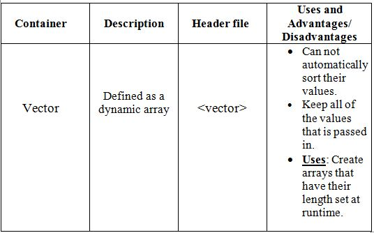
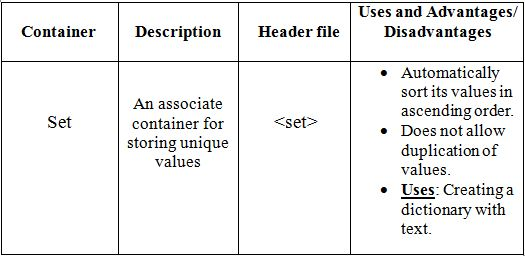
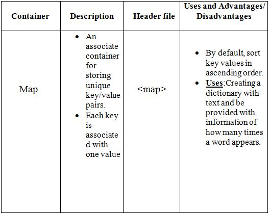

# A-STL-blog

Hello everyone, welcome back to my blog, and to day we will discuss a little bit about Standard Template Library or STL for short.&nbsp

Before we jump into what STL is and what it does, we first have to ask ourselves, what is a class/function template? It is best described with an analogy. Let's just say you want to create 10 letter K with the same font but with different colors and patterns, in normal convention, you would have to paint by hand all 10 of those K and then decorate them, but what if you have a stencil? By placing the stencil on another object, then spraying paint through the hole, you can create multiple letter K with a variety of patrerns.
That's what a class/function template does, class/function templates are classes/functions that serve as a pattern for creating other similar classes/functions. We can create a generic class/function without having to specify the exact type(s) of some or all of the variables.&nbsp
Now that we know what a class/function templates is, we can start asking the bigger question: "What is STL and what are its uses in C++"?&nbsp
Again this is best explained through an analogy, let's go back to our stencil analogy, imagine STL being a store that sells stencils, when you walk inside the store, you will meet lanes which in this case represents header files.
In those lanes, lots of stencils(class/function templates) are on display, if you want to create something with that stencil, you buy it and use it to your own desire.&nbsp

That's technically what STL is: a place that hold class and function templates. And when you want to use those templates, you create a statement with the form:&nbsp
                   class/function_template_name <type> class/function_name ;
STL is very powerful because it is equipped with all the common classes and functions that you can use in your code, without STL, you will have to manually create new functions and classes everytime your data type needs to change, which could take a a long time. If you know how to use STL correctly, your coding will feel so much easier.&nbsp
By far the most commonly used functionality of the STL library are the STL container classes.&nbsp
The STL contains many different container classes that can be used in different situations.&nbsp

Containers in STL are divided into the following types:
1. Sequence containers :
* Vector
* Deque
* List
2. Associative containers :
* Set
* Multiset
* Map
* Multimap
3. Container adapters :
* Stack
* Queue
* Priority-queue
In each container, there are a lot of member functions which you can use to perform different tasks on your object.&nbsp

Let's see how some of them works, shall we?
1. Vector:&nbsp

Click the link below to see how vector works with its member functions:
[vector codes](https://github.com/KaTE-the-coder/A-STL-blog/blob/master/vector.cpp)

In main, type in the function setVector():
[vector main](https://github.com/KaTE-the-coder/A-STL-blog/blob/master/main.cpp)

When we output it, it will have the result:&nbsp
Before std::sort:&nbsp
1 2 4 3 6 10 - 1 0&nbsp
After std::sort:&nbsp
-1 0 1 2 3 4 6 10&nbsp

So the std::vector by default doesn't do the sorting, the order of the values in it is the exact order we put the values in.
By using std:: sort from <algorithm> header file, can we sort the values.&nbsp

Fortunately there's one class container we can use to fix std:: vector downside, std::set.&nbsp

2. Set:&nbsp

Click the link below to see how set works with its member functions:
[set code](https://github.com/KaTE-the-coder/A-STL-blog/blob/master/set.cpp)

In main, type in the function setSet():
[set main](https://github.com/KaTE-the-coder/A-STL-blog/blob/master/main.cpp)

The output will be:&nbsp
-1 0 1 2 3 4 5 7 100&nbsp
As you can see, it automatically sort them in ascending order and no duplication of integers are performed.&nbsp

3. Map:&nbsp
std::map is similar to std::set however std::map has a combination of a key value and a mapped value while std::set only has the key value.

Click the link below to see how map works with its member functions: 
[map codes](https://github.com/KaTE-the-coder/A-STL-blog/blob/master/map.cpp)

In main, type in the function setMap() :
[map main](https://github.com/KaTE-the-coder/A-STL-blog/blob/master/main.cpp)

The output will be:&nbsp
Ariadne 23&nbsp
Arthur 29&nbsp
Cobb 36&nbsp
Eames 33&nbsp
Robert 33&nbsp

So by default, std::map sort key values in ascending order.&nbsp

All of the conatiners in STL all have similar member functions and if you use them correctly, they can be very useful for you.
That's all for today, folks. I will see a next time.
